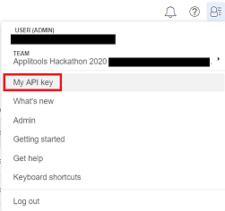

# applitools-hackathon-2020

This is my solution for the Applitools Hackathon. The project uses WebdriverIO v5, Applitools Eyes and mocha to provide UI automation tests for 3 tasks presented in the [hackathon instructions](https://applitools.com/cross-browser-testing-hackathon-v20-1-instructions/).

Each task had to be automated in traditional manner (meaning using only WebdriverIO without Applitools) and in modern way (meaning using WebdriverIO with Applitools). 

Traditional test code for version 1 of the app is [TraditionalTestsV1.spec.ts](./test/TraditionalTestsV1.spec.ts). Traditional test code for version 2 of the app is [TraditionalTestsV2.spec.ts](/test/TraditionalTestsV2.spec.ts). 
They happen to be the same. 
The reason for that is: I worked on tests for version 1  until I was satisfied completely and then I ran the same tests on version 2 of the app. I have to admit writing modern tests using Applitools made it much easier for me to enhance my script for traditional tests. 

Modern test code for version 1 of the app is in [ModernTestsV1.spec.ts](/test/ModernTestsV1.spec.ts). Modern test code for version 2 of the app is in [ModernTestsV2.spec.ts](/test/ModernTestsV2.spec.ts). They are also the same since with Applitools there is a lot less maintenance work to be done.

Each task had to be run against [version 1](https://demo.applitools.com/gridHackathonV1.html) of the demo app which is "bug free". Also, each task had to be run against [version 2](https://demo.applitools.com/gridHackathonV2.html) of the demo app which is full of bugs. 

Traditional script results ran against version 1 of the app are [Traditional-V1-TestResults.txt](/Traditional-V1-TestResults.txt).

Traditional script results ran against version 2 of the app are [Traditional-V2-TestResults.txt](/Traditional-V2-TestResults.txt).  

Modern script results ran against version 1 of the app are [here > Eyes Batch Results](https://eyes.applitools.com/app/test-results/00000251809542730847) in my Applitools Dashboard app.

Modern script results ran against version 2 of the app are [here > Eyes Batch Results](https://eyes.applitools.com/app/test-results/00000251809542431441) in my Applittols Dashboard app.

All tests run headless, and you can check status of the execution in the console. 
## Requirements

- [NodeJS](https://nodejs.org/en/) version v10.16.3 or higher.
- installed browsers:
  - [Chrome](https://www.google.com/chrome/) - used version `83.0.4103.106(64-bit)`
  - [Firefox](https://www.mozilla.org/en-US/firefox/new/) - used version `77.0.1(64-bit)`
  - [Edge Chromium](https://www.microsoft.com/en-us/edge) - used version `83.0.478.54(64-bit)`

Note: 

Test scripts developed and tested on `Windows 10 Enterprise`.

## Quick start

1. clone this repository

       git clone https://github.com/mareru/applitools-hackathon-2020.git
2. on the command line go to the project root folder `applitolls-hackathon-2020`
3. to install dependencies run the command

       nmp install
4. set environment variable `APPLITOOLS_API_KEY` needed to run modern scripts with Applitools Eyes:

        Mac: export APPLITOOLS_API_KEY='YOUR_API_KEY'
        Windows: set APPLITOOLS_API_KEY='YOUR_API_KEY'
   You can get the key by creating the account on the [Applitools website](https://applitools.com/users/register).  
   Once you create the account and log in to the Applitools Eyes Test Manager application, there you can find the key value. 
   
   
5. delete [Traditional-V1-TestResults.txt](/Traditional-V1-TestResults.txt) and [Traditional-V2-TestResults.txt](/Traditional-V2-TestResults.txt) 
   prior to running traditional tests in order to have clean test results.
6. run the traditional tests against version 1 of the app:

        npm run test:traditional:v1
   run the traditional tests against version 2 of the app:
   
        npm run test:traditional:v2
   run the modern tests against version 1 of the app:
   
        npm run test:modern:v1
   run the modern tests against version 2 of the app:
   
        npm run test:modern:v2

## Author

Marijana Rukavina - [Githhub](https://github.com/mareru)

